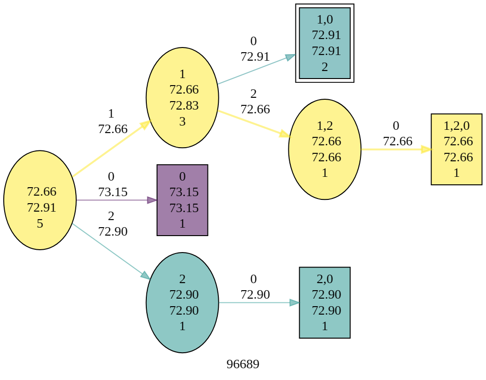

# MLCSE (aka RLCSE)

**MLCSE** is a program to orchestrate optimization of the JIT's CSE heuristic via
Reinforcement Learning, and to help with related tasks.

## Background

### Reinforcement Learning

Reinforcement Learning is a branch of Machine Learning that learns how to optimize an objective without the aid of an external oracle or expert. RL can handle problems where the end result is the consequence of a sequence of actions, and where each action potentially provides a reward, modifies the state of the environment and potentially alters the set of possible future actions. It seems like a natural choice for developing compiler optimization heuristics as there are often many decisions to be made on imperfect knowledge with difficult to anticipate consequences.

RL is currently an active and thriving area of research, innovation, and practice. Sutton &amp; Barto's text *Reinforcement Learning* is a good introduction; see the references section at the end of this document for other suggested readings.

### Common Subexpression Elimination (CSE)

CSE is a classic compiler optimization that detects and removes redundant computations. See for instance Muchnick, Section 13.1.

For example, in the following bit of code, the value of `j * 3` is redundantly computed and the program will likely run a bit faster if the result is only computed once:
```C#
// Before CSE
int i = j * 3;
int k = j * 3;

// After CSE
int temp = j * 3;
int i = temp;
int j = temp;
```
In the JIT the CSEs are recognized by value numbers, so the expressions computing the values need not be textually identical; for instance the computations for `i` and `l` are redundant here:
```C#
int i = j * 3;
int k = j;
int l = k + 2 * j;  // equivalent to j * 3
```
To first order, CSEs are always a good optimization to perform&mdash;they make the program code both faster and smaller. However there are a finite set of registers available on the machines we target, and each new CSE temp increases the competition for register slots, and eventually that competition imposes some additional size and speed costs that may overtake the benefit from removing the redundancy. 

A particularly important case is the "live across call" case:
```
int i = j * 3;
foo();
int k = j * 3;
```
Here to cheaply preserve the value of `j * 3` the temp must occupy a "callee-save" register and these are a scarce resource (But note in the original program `j` itself was live across the call, so if it turns out that there are no more uses of `j` then the demand on callee saves remains the same).

In the JIT there is a related optimization called Hoisting (aka Loop Invariant Code Motion) that will deliberately create CSE opportunities in order to remove redundant computation from a loop. For example
```C#
// Before Hoisting
for (int i = 0; i < 100; i++)
{
    int k = j * 3;
}

// After Hoisting
int temp = j * 3;
for (int i = 0; i < 100; i++)
{
    int k = j * 3;
}

// After CSE
int temp = j * 3;
for (int i = 0; i < 100; i++)
{
    int k = temp;
}
```
Hoisting is especially beneficial as it can optimize away repeatedly redundant computations: here instead of performing 100 multiplies, the code will only do one.

The upshot of all this is that the benefit of a CSE is highly context dependent. For a given method the best choice may be to do no, some, or all of the possible CSEs. The JIT relies on a *heuristic* to make this determination, and the aim of this work is to develop better techniques for crafting heuristics.

The current heuristic in the JIT is fairly complicated. I am not going to attempt to describe it here except in broad terms. It was carefully hand crafted. It makes observations about each CSE candidate, ranks them, and then performs them in rank order, until some threshold is reached. That threshold steadily increases as CSEs are performed. For more details you are welcome to examine [the code]( https://github.com/dotnet/runtime/blob/6fa046837910fcc7a7dbd64be4b1ad98f9ea5db3/src/coreclr/jit/optcse.cpp#L4035-L4450). You may also find the most recent [tuning PR](https://github.com/dotnet/runtime/pull/1463) enlightening.

There are also other aspects of the CSE problem worth consideration. My feeling is that these should await the successful development of an RL based heuristic since they represent hard to evaluate or more dynamic options:
* The set of expressions that can form CSE candidates can potentially be enlarged, if we can develop successful heuristics to properly handle candidates with very marginal benefits ("cheap cses").
* The grouping of expressions into candidates can be modified, and it may be beneficial to split or merge candidates as the algorithm proceeds (see e.g. [reconsider multi def cses](https://github.com/dotnet/runtime/issues/97243])).

## Applying RL to CSEs

Our immediate ambition is to use RL to craft a better heuristic for CSEs. More broadly we hope to establish a set of techniques we can apply on other heuristics throughout the JIT.

### What To Optimize For

In general an RL algorithm is ultimately motivated by **rewards** obtained during or after a sequence of actions. RL tries to maximize the reward by finding optimal sequences of actions (or at least very good ones). It learns by trial and error, repeatedly attempting different behaviors, and using the difference in the rewards obtained across those behaviors to update the **policy** that it is using to make decisions.

In our case the main objective is improved or at least on-par performance of every bit of code the compiler is asked to optimize in realistic applications (in our case these bits of code are parts of methods, so from here on out we will just say **methods**).

The obvious thing to is to try and directly measure performance, say by running a suite of benchmarks with various methods in them. But this leads to complications:
* Performance of a benchmark may only be influenced by a small number of methods, and those methods might not have interesting CSE opportunities (not every method does). Or, the prominent methods in a benchmark may have CSEs  that are "easy" to build a heuristic for, since benchmark methods tend to have long-running loops (see repeated measurement, below), so flaws or shortcomings in the policy might not be highlighted by benchmarking.
* Performance impacts of CSEs may be fairly small, and benchmark measurements are potentially noisy. To try and keep noise level down benchmarking systems usually rely on repeated measurement; this makes obtaining data slow. So benchmark data is both noisy and costly to obtain.
* Performance numbers can vary over a wide dynamic range, so assessing aggregate performance of a heuristic over multiple benchmarks requires some care.
* Benchmarks are not generally realistic programs. Benchmarking realistic programs is also hard, they are demanding to run, slow, noisy, and rarely contain methods with prominent performance.

### Enter the Perf Score

To mitigate some of these problems, we'll instead optimize something that is cheap to produce and (less) noisy: the **Perf Score** for the method. This is a synthetic measurement of the expected exclusive execution time for a single call to the method (*exclusive* meaning it does not compute the time spent in methods called by the method), computed at the very end of jitting once the final instructions are known.

These instructions are typically grouped into *basic blocks* representing sequential executions of instructions, broken up by control flow instructions (branches). We use a simple machine model to estimate the execution time of each block, given the instructions it contains. The perf score is a weighted sum of block costs, where each block's score is the relative execution frequency of the block times the block's time estimate.

For example, in a simple method like:
```C#
int Sum(int j)
{ 
    int sum = 0;
    for (int i = 0; i < 100; i++)
    {
        sum += j * 3;
    }
    return sum;
}
```
THere there are 3 blocks, one for the instructions before the loop (A), one for the instructions in the loop (B), and one for instructions after the loop (C), and the overall perf score will be 
```
perf score = time(A) + 100 * time(B) +  time(C)
```
The belief is that this core is generally well correlated with the actual time required to execute the method, so that optimizing a method for perf score also optimizes it for performance.

There is ample reason to be skeptical about the quality of this correlation; for details feel free to look at [this analysis](https://github.com/dotnet/runtime/issues/92915#issuecomment-1744042491). However the benefits of relying on perf scores are large, and we can always try confirming ore refuting the results with benchmarks.

Also note that for perf score, *lower is better*. So the goal is to minimize the score. And, like actual times, there can be a very wide dynamic range in scores across methods; some will have single-digit perf scores, and others will have scores in the millions (or more).

### Super PMI (aka SPMI) and MCH files

In normal operation the JIT runs on-demand as the methods of an application are first encountered (JIT means just-in-time, after all). This is unwieldy for our purposes because there is a lot of other overhead involved in running an application. A typical JIT invocation takes perhaps 1ms, and just launching a do-nothing process and returning may take 30ms or more,and with innovations like tiered compilation and dynamic PGO it may take considerably longer to generate an optimized version. So it's fairly inefficient to actually run applications to exercise the JIT and study the impact of CSEs.

In the RL setting we'll need to run the JIT over hundreds or thousands of different methods, and for each method, run the JIT hundreds or thousands of times. Thus any inefficiency here gets amplified a millionfold and becomes really costly.

Luckily we have a very tightly crafted interface between the JIT and the rest of the .NET runtime, and we can interpose on that interface to observe and record all the traffic, then replay that traffic later on. From the JIT's standpoint it can't readily tell the difference (with a few exceptions) and almost all of the overhead associated with running the application is removed. This technology is called SPMI, and with it we can rerun the JIT on a method at a very high rate of speed (aka SPMI replay).

With SPMI we can also (within certain limits) vary the JIT behavior, so long as any query the JIT makes has pre-recorded answer. Luckily for us, for CSEs this is almost always the case.

The files containing the recorded interface traffic are known as MCH files (method context hives). We perform SPMI collections on a regular basis and save off the files in a download cache. The collections are somewhat fragile, depending both on the interface version (which changes with some frequency) and the behavior of the JIT during collection.

### Architecture and OS

The JIT typically runs on the same machine architecture and OS that it itself was compiled for&mdash;that is there is a Windows x64 compiled JIT that produces code to run on Windows x64.

But we also create "cross-targeting" JITs where the code the JIT produces is for a different Architecture or OS (or both). These can be hosted in SPMI and used to replay JIT behavior too. So one can run SPMI replay on Windows x64 and generate code for Linux arm64.

### Other Optimization Goals

Before moving on to examine how to leverage perf scores as part of developing an RL based heuristic, I want to mention in passing that it is not the only metric under consideration. We also care quite a bit about the time it takes for the JIT to compile the method, and the size of the generated code.

To first order these should be somewhat well correlated; that is larger code will take longer to produce. Both can be measured directly; code size is noise free. So as a secondary objective we'd like to minimize the code size as well.

## Mapping RL and JIT/CSE Concepts

This section assumes a familiarity with at least one of the two.

| RL Concept  | M Concept | Notes |
|--- | --- |--- |
| State $s$ | Method + CSEs Performed | see below |
| Action $a$ | A CSE not yet performed, or the decision to stop and leave some CSEs undone | Each CSE candidate can be done at most once. We use non-negative numbers to describe candidates, eg `1` or in jit diagnostics, `CSE #01`. By convention action `0` is the stop action. |
| Rollout | The sequence of CSEs performed by the heuristic | Sequence: e.g. 3,1,0
| Reward $r$ | Perf Score | Lower is better. The only action providing a reward is the stop action |
| Discount $\lambda$| n/a | We use an "undiscounted" approach. Discount allows RL algorithm to value immediate rewards more than future rewards; we have no immediate rewards (alternatively, $\lambda = 1$) |
| Terminal State | Result of the stop action | Once the JIT decides to stop doing CSEs, it can run the rest of its phases and obtain the perf score|
| Policy $\pi$ | CSE heuristic | At each step, decides which CSE to do next, or decides to stop |
| Parameterized Policy $\pi_\theta$ | CSE heuristic with tuning knobs | $\theta$ will typically be a vector
| True value of a state $s$ under policy $\pi$: $v_\pi(s)$ | Perf score obtained by performing CSEs following $\pi$ from this state forward |
| True value of an action $a$ from state $s$: $\pi$: $q_\pi(s, a)$ | Perf score obtained by doing CSE $a$ and then performing CSEs following $\pi$ thereafter |
| Estimated value $V_\pi(s)$ | Current best guess at true value of this state for policy $\pi$ | Best perf score known for this method, given the CSEs performed so far |
| Estimated value $Q_\pi(a,s)$ | Current best guess at true value of this action in this state for policy $\pi$ | Best perf score known for this method, given the CSEs performed so far and this one extra CSE |
| Greedy Policy | Greedy Heuristic | Heuristic that always chooses the best CSE (by its own estimation) to do next |
| Stochastic Policy | Exploratory Heuristic | Heuristic that sometimes chooses the best CSE (by its own estimation) to do next, and sometimes makes other choices |
| Stochastic Distribution $\pi(a \| s, \theta)$ | Softmax Likelihood | Likelihood of doing CSE $a$ under a stochastic policy|
| Monte Carlo Policy | Random Heuristic | Performs CSEs or stops randomly |
| Current Policy | Baseline Heuristic | The current hand-crafted CSE heuristic in the JIT |
| Optimal policy $\pi_*$ | Oracle | Heuristic that always makes the best choice for what to do next |
| Optimal value $v_*(s)$ | Best possible outcome | Perf score obtainable by following the optimal policy from this state |
| Optimal action value $q_*(s,a)$ | Best possible outcome given this action | Perf score obtainable by doing a particular CSE an then behaving optimally |
| Preference for action $h(a, s, \theta)$ | Candidate preference | preference for doing CSE $a$ given method and CSEs done already $s$ and model parameters $\theta$ |
| $\boldsymbol{x}(a,s)$ | Candidate features | observations about a candidate |

## MLCSE Overview

At long last we are ready to dive into MLCSE proper.

MLCSE has 3 main modes of operation:
* MCMC: Exploration of possible CSEs and their consequences via randomized search. For each method the sequences of states and actions form a simplistic Markov Chain. Hence the acronym (Markov Chain Monte Carlo). Our system is deterministic and each action leads to a distinct state, so the Markov Chain is a tree.
* Feature Analysis: extract the features for the initial set of actions. This data can be used to plot feature value distributions to better normalize or whiten the feature space.
* Policy Gradient: try and craft a linear policy that minimizes the aggregate perf score or code size of a set of methods.

### Prerequisites to Running MLCSE

In order to run MLCSE you must:
* Clone and build the runtime repo (https://github.com/dotnet/runtime) and install all the necessary prerequisites for building (see https://github.com/dotnet/runtime/tree/main/docs/workflow/building/coreclr)
* Build a checked runtime and test environment (aka Core_Root). See https://github.com/dotnet/runtime/blob/main/docs/workflow/testing/coreclr/testing.md.
* Download (or create) a suitable MCH file to use for training
* Install .NET 6
* Clone the jitutils repo (https://github.com/dotnet/jitutils)

In the examples below we'll assume the current working directory is the `src/jit-rl-cse` directory of your jitutils clone.

### Configuring Toolset and SPMI Collection

To run MLCSE, use `dotnet run --` followed by options. You will need to specify both the SPMI collection (via `-s`) and the Core_Root (via `-c`), for example:

```
dotnet run -- -s d:\spmi\mch\86eab154-5d93-4fad-bc07-e94fd9268b70.windows.x64\aspnet.run.windows.x64.checked.mch -c c:\repos\runtime0\artifacts\tests\coreclr\Windows.x64.Checked\Tests\Core_Root
```
Since these options will be common to many runs, you can save them in a response file and tell MLCSE to include that file. For example, if we create a file a file called `config.rsp` with the lines:
```
-s d:\spmi\mch\86eab154-5d93-4fad-bc07-e94fd9268b70.windows.x64\aspnet.run.windows.x64.checked.mch
-c c:\repos\runtime0\artifacts\tests\coreclr\Windows.x64.Checked\Tests\Core_Root
```
Then we can simply do
```
dotnet run -- @config.rsp
```
By default, MLCSE will run the policy gradient algorithm on 5 randomly chosen methods from the SPMI collection:
```
RL CSE Experiment
CoreRoot c:\repos\runtime0\artifacts\tests\coreclr\Windows.x64.Checked\Tests\Core_Root
Collection d:\spmi\mch\86eab154-5d93-4fad-bc07-e94fd9268b70.windows.x64\aspnet.run.windows.x64.checked.mch
Output saved to d:\bugs\cse-metrics
141813 methods, 39749 methods with cses; 226844 cse candidates, 66846 cses
22904 methods with between 1 and 10 cses, randomly choosing 5.

Policy Gradient: 5 methods, 10000 rounds, 25 runs per minibatch, 6 salt, 0.02 alpha, optimizing speed
Rnd       96689      81793      75037      81423      35733
Base      72.91      27.50     276.65      24.12      24.12
   0      73.15      30.50     276.11      25.50      24.50
   1      73.15      30.50     276.11      25.50      24.50
```

MLCSE uses SPMI to invoke the JIT. By default each SPMI invocation is an new process launch. You can speed these up by creating server SPMI processes that can be sent traffic in "streaming mode", via `--streamSPMI`.

### Method Selection

In MCMC by default, methods are selected randomly from the subset of methods in the collection that have CSE candidates (39746 out of 141813) in the above. This subset is further refined so the number of candidates lies in a certain range ([1..10] by default, 22904 methods in the above).

You can modify method selection as follows:
* `-n` specify number of candidates
* `-a` specify additional methods along with the random subset
* `-u` specify the exact methods to use
* `--minCandidates` specify the minimum number of candidates
* `--maxCandidates` specify the maximum number of candidates
* `--randomSample false` just pick the first N candidates
* `--randomSampleSeed` specify random seed (salt)

### All Options
You can see all the available options and defaults:
```
dotnet run -- -?

Description:
  Use ML to explore JIT CSE Heuristics

Usage:
  MLCSE [options]

Options:
  -?, -h, --help                      Show help and usage information
  -v, --version                       Show version information
  -s, --spmi                          SPMI collection to use
  -c, --core_root                     Checked Core Root to use
  -o, --outputDir                     directory for dumps and logs
  -n, --numMethods                    number of methods to use for learning [default: 5]
  --randomSample                      use random sample of methods [default: True]
  --randomSampleSeed                  seed for random sample of methods [default: 42]
  --minCandidates                     minimum number of CSE candidates for randomly chosen method [default: 1]
  --maxCandidates                     maximum number of CSE candidates for randomly chosen method [default: 10]
  -u, --useSpecificMethods            only use these methods (via spmi index)
  -a, --useAdditionalMethods          also use these methods (via spmi index)
  -f, --doFeatures                    gather and describe features of the CSE candidates in the methods
  -m, --doMCMC                        run a Monte Carlo Markov Chain (MCMC) exploration for each method
  --rememberMCMC                      remember MCMC results when running Policy Gradient
  --showEachMethod                    show per-method summary of MCMC results
  --showEachMCMCRun                   show per-run details of MCMC results
  --showMarkovChain                   show Markov Chain (tree) of CSE decisions
  --showMarkovChainDot                show Markov Chain (tree) of CSE decision in dot format
  --doRandomTrials                    explore randomly once candidate count threshold has reached [default: True]
  --minCandidateCountForRandomTrials  threshold for random exploration [default: 10]
  --numRandomTrials                   number of random trials [default: 512]
  --saveParetoFrontier                save Pareto Frontier showing perf score / code size tradeoffs
  -g, --doPolicyGradient              build optimal policy via Policy Gradient [default: True]
  --showEachRun                       show details of policy evaluations or updates
  --showSPMIRuns                      show each SPMI invocation
  --numberOfRounds                    number of rounds of training for Policy Gradient [default: 10000]
  --minibatchSize                     minibatch size -- number of trials per method per round [default: 25]
  --showTabular                       show results in a table [default: True]
  --showRounds                        show per-method per-round policy average perf scores [default: True]
  --showRoundsInterval                if showing per-round results, number of rounds between updates [default: 1]
  --showPolicyEvaluations             show details of stochastic policy makes its decisions (very detailed)
  --showPolicyUpdates                 show details of how policy parameters get updated (very detailed)
  --showSequences                     show CSE sequences per method
  --showParameters                    show policy parameters at end of each round
  --showLikelihoods                   show per method the likelihood for each sequence element
  --showBaselineLikelihoods           show per method the initial likelihood for each CSE and stopping
  --showRewards                       show per method the reward sequence computations
  --salt                              initial salt value for stochastic policy RNG [default: 6]
  --alpha                             step size for learning [default: 0.02]
  --summaryInterval                   summarize progress after this many rounds [default: 25]
  --showGreedy                        show greedy policy results for method subset in the summary [default: True]
  --showFullGreedy                    show greedy policy results for all methods in the summary [default: True]
  --initialParameters                 Initial model parameters (comma delimited string, padded with zeros if too few) []
  --optimizeSize                      try to minimize code size instead of perf score
  --saveQVDot                         save MC diagrams for each method each summary interval
  --saveDumps                         save dumps for various CSE sequences for the indicated method
  --showSPMIRuns                      show each SPMI invocation
  --streamSPMI                        use streaming mode for per-method SPMI requests
  --logSPMI                           write log of spmi activity to output dir
  --statsSPMI                         dump server stats each summary interval
  ```
### MCMC

MCMC uses a Monte Carlo policy to explore the possible sequences of CSEs (rollouts) and their associated perf scores (rewards). Given that our problem instances are finite, with enough time, MCMC will uncover the optimal perf score and CSE sequence for any particular method.

In MLCSE we often rank methods by the number of CSE candidates $N$; this can vary from 0 to 64 (64 is an artificially imposed upper bound to limit the cost of forming candidates; without this limit there are methods with hundreds and even thousands of candidates. But they are uncommon).

The [number of subsequences](https://oeis.org/A000522) grows rapidly with $N$, faster than $N!$. For small values of $N$ MLCSE can exhaustively expore all the possibilities. For larger values it chooses sequences randomly. In exhaustive mode it also currently assumes that the order of CSEs does not matter; this may or may not be true (see **Open Questions**, below).

Given a set of sequences and rewards, MCMC can produce a textual or graphical description of the Markov Chain for a method. MCMC can also use the best code size and perf scores to describe the "pareto frontier" of tradeoffs available.

#### Running MCMC

To run MCMC (and disable Policy Gradient), pass `-m -g false`. This will randomly choose methods, explore the range of possible perf scores and code sizes available by varying CSEs, and compare the results to the current JIT heuristic (baseline).
```
RL CSE Experiment
CoreRoot c:\repos\runtime0\artifacts\tests\coreclr\Windows.x64.Checked\Tests\Core_Root
Collection d:\spmi\mch\86eab154-5d93-4fad-bc07-e94fd9268b70.windows.x64\aspnet.run.windows.x64.checked.mch
Output saved to d:\bugs\cse-metrics
141813 methods, 39749 methods with cses; 226844 cse candidates, 66846 cses
22904 methods with between 1 and 10 cses, randomly choosing 5.

  ---baseline heuristic had optimal perf score in 3 of 5 methods 60.00%; best/base 0.999 base/none 1.001 best/none 1.000 best(size)/base 0.999 (288 runs in 1974ms)

  ---baseline heuristic had optimal code size  in 4 of 5 methods 80.00%; best/base 0.997 base/none 1.003 best/none 1.000 best(score)/base 0.997
```
This gives us an idea of how close the current JIT heuristic (base) is to optimal, and also the total perf score increase possible via CSEs. Here 2 of the 5 methods are not optimal.

To see details, add ``-showEachMethod`` (output below edited slightly to fit the screen)
```
              ================== PERF SCORES ========================= 
INDEX   N      BEST       BASE      WORST      NOCSE     RATIO    RANK 
 96689  2     72.66      72.91      73.15      73.15     0.997    3/5  
 81793  2     27.50      27.50      30.50      30.50     1.000    1/5  
 75037  8    274.55     276.65     277.68     276.11     0.992  161/257
 81423  3     24.12      24.12      25.50      25.50     1.000    1/9  
 35733  4     22.25      24.12      26.38      24.50     0.922    3/17 
```
This shows results for 5 methods:
* `N` indicates the number of candidates
* `BEST` is the best score found
* `BASE` is the score for the current JIT heuristic
* `WORST` is the worst score found
* `NOCSE` is the score if no CSEs are done
* `RATIO` is best/base
* `RANK` is how base fares against all other results

So for method `96689`, with 2 candidates, best is slightly better than base, and both are better than doing no CSEs.

Next to that is similar data for code size
```
              ==================== CODE SIZE =========================   
INDEX   N     BEST       BASE      WORST      NOCSE     RATIO    RANK    
 96689  2     197.00     200.00     205.00     205.00     0.985    2/5   
 81793  2     132.00     135.00     138.00     135.00     0.978    2/5   
 75037  8    1228.00    1234.00    1250.00    1248.00     0.995  113/257 
 81423  3     149.00     149.00     151.00     151.00     1.000    1/9   
 35733  4     239.00     246.00     263.00     256.00     0.972    3/17    
 ```
Further to the right MCMC will show the sequences for best and base perf score and code size
```      
INDEX   N 
 96689  2   best score [2,1]/4 best size [2,1]/4 base [1]          
 81793  2   best score [1,2]/5 best size [1,2]/5 base [2,1]        
 75037  8   best score [2,3,5,6]/256 best size [5,6]/1 base [5,6]  
 81423  3   best score [1]/9 best size [1]/9 base [1]              
 35733  4   best score [1,2,4]/17 best size [1,2,4]/17 base [1,2,4]  
```
So for `96689` the best score sequence 2,1 is also the best size sequence (here we leave off the terminal 0).

To see the details of each MCMC run, pass `--showEachMCMCRun`. And to limit the exploration to just a particular set of methods, pass `-u methodnum1 methodnum2`. For example here are the details for the runs for method `96689`:
```
Method 96689 base score 72.91 base size 200 base seq 1,0
Method 96689 mask 0x1 score 72.91 size 200 seq 1,0
Method 96689 mask 0x0 score 73.15 size 205 seq 0
Method 96689 mask 0x2 score 72.9 size 202 seq 2,0
Method 96689 mask 0x3 score 72.66 size 197 seq 1,2,0
```

You can also get graphic or test data representing the Markov Chain $v_*$ and $q_*$.  For text, use `--showMarkovChain`
```
96689 |                |  1| 72.65999999999999659  [3] **best**
96689 |                |  0| 73.15000000000000568  [1]
96689 |                |  2| 72.90000000000000568  [1]
96689 |              1 |  0| 72.90999999999999659  [2]
96689 |              2 |  0| 72.90000000000000568  [1]
96689 |              1 |  2| 72.65999999999999659  [1] **best**
96689 |            1,2 |  0| 72.65999999999999659  [1] **best**
```
The second column shows the state, the third the action. So from initial state there are 3 actions: 0, 1, or 2. 

To see this graphically, pass `--showMarkovChainDot` or `--saveQVDot` which will produce output in the graphviz `dot` markup format. 
```
digraph G
{
  rankdir = LR;
  label="96689"
   "1,0" [ label="\N\n  72.91\n  72.91\n2"; style = filled; fillcolor = "#218c8d80"; peripheries = 2; fontsize = 14; shape = box];
   "" [ label="\N\n  72.66\n  72.91\n5"; style = filled; fillcolor = "#fde72480"; fontsize = 14;];
   "1" [ label="\N\n  72.66\n  72.83\n3"; style = filled; fillcolor = "#fde72480"; fontsize = 14;];
   "0" [ label="\N\n  73.15\n  73.15\n1"; style = filled; fillcolor = "#44015480"; fontsize = 14; shape = box];
   "2" [ label="\N\n  72.90\n  72.90\n1"; style = filled; fillcolor = "#1f928c80"; fontsize = 14;];
   "2,0" [ label="\N\n  72.90\n  72.90\n1"; style = filled; fillcolor = "#1f928c80"; fontsize = 14; shape = box];
   "1,2" [ label="\N\n  72.66\n  72.66\n1"; style = filled; fillcolor = "#fde72480"; fontsize = 14;];
   "1,2,0" [ label="\N\n  72.66\n  72.66\n1"; style = filled; fillcolor = "#fde72480"; fontsize = 14; shape = box];
   "" -> "1" [label = "1\n  72.66"; color = "#fde72480" style = bold; ];
   "" -> "0" [label = "0\n  73.15"; color = "#44015480"];
   "" -> "2" [label = "2\n  72.90"; color = "#1f928c80"];
   "1" -> "1,0" [label = "0\n  72.91"; color = "#218c8d80"];
   "2" -> "2,0" [label = "0\n  72.90"; color = "#1f928c80"];
   "1" -> "1,2" [label = "2\n  72.66"; color = "#fde72480" style = bold; ];
   "1,2" -> "1,2,0" [label = "0\n  72.66"; color = "#fde72480" style = bold; ];
}
```
Run this through a tool or paste into an online viewer like sketchviz.com:



Here colors highlight the best possible perf scores. Each node has 4 lines of text
* the state
* the best perf score $v_*$
* the average perf score across all MCMC rollouts
* the number of rollouts passing through this state

Finally, you can also get a tabular description of the pareto fronter of best score/size combinations (recall the pareto front is the set of results where any other result has worse score, worse size, or both), via `--saveParetoFrontier`. For example:
```
Method,OnFrontier,PerfScore,CodeSize,rPerfScore,rCodeSize
75037,1,274.55,1236,0.9924091812759807,1.0016207455429498
75037,1,275.07,1232,0.9942888125790711,0.9983792544570502
75037,1,275.08,1228,0.9943249593348997,0.9951377633711507
75037,0,276.11,1246,0.9980480751852523,1.0097244732576987
```

## Policy Gradient

Policy Gradients are reinforcement learning algorithms that try and learn a good policy $\pi$ directly, rather than first learning (or estimating) the state and action functions $v$ and $q$ and then crafting a policy from those.

In MCLSE, we have implemented a fairly "vanilla" Policy Gradient, using a linear model with baselines, but blending in some aspects of the actor-critic approach. This follow largely along the lines of Sutton &amp; Barto Chapter 13. More details on this below.

In our work the orchestration of the rollouts and computations of the "reward" terms is done on the C# side, and the policy is implemented in the JIT code via `CSE_HeuristicRL`. Information is passed to the JIT via `DOTNET` config settings, and passed back from the JIT via SPMI's stdout.

### Orchestration

When starting Policy Gradient, MLCSE first simply runs the JIT over the entire collection, collecting information about baseline candidate counts, perf scores, and code sizes. This information is cached in a file alongside the collection in a `.cse` file, and so only needs to be computed once (note it is JIT version specific, so if you change the JIT, you should delete this file.)

This baseline data is fed into the method selection process to obtain the set of methods to train on. By default 5 methods are chosen. I have run experiments with up to 500 methods.

The initial model parameter vector is taken to all be zero (`--initialParameters` to specify something different). The optimization goal is lower perf score (`--optimizeSize` to change to lower code size).

Training then proceeds in a series of *rounds*, where, on each round
* For each method in the training set
  * Perform a concurrent *minibatch* of 25 runs (alter via `--minibatchSize`) using the current parameter vector, where each batch run
    * JITs the method using a stochastic policy, obtaining the sequence and perf score / code size
    * Computes the per-step "reward" sequence (based on score or size)
    * JITs the method again, specifying the CSE sequence and the reward sequence (aka "replay policy"). This should perform the exact same sequence of CSEs as the stochastic policy
    * Obtains the updated parameter set from the JIT
  * Averages the minibatch parameter updates, and use that as the parameter vector for the next method.
* Rounds continue until the limit (`--numberOfRounds`, default 10,000) is reached, or the parameters have not changed in the past 50 rounds.

This the orchestration "round-robins" through the methods in the training set. The JIT invocations in the minibatch are run concurrently to speed up training.

By default most of the details of this are hidden, and MLCSE displays a tabular form with one column per method, giving the average score/size for that method across the minibatch.

```
RL CSE Experiment
CoreRoot c:\repos\runtime2\artifacts\tests\coreclr\Windows.x64.Checked\Tests\Core_Root
Collection d:\spmi\mch\86eab154-5d93-4fad-bc07-e94fd9268b70.windows.x64\aspnet.run.windows.x64.checked.mch
Output saved to d:\bugs\cse-metrics
141813 methods, 39749 methods with cses; 226844 cse candidates, 66846 cses
22904 methods with between 1 and 10 cses, randomly choosing 5.

Policy Gradient: 5 methods, 10000 rounds, 25 runs per minibatch, 6 salt, 0.02 alpha, optimizing speed
Rnd       96689      81793      75037      81423      35733
Base      72.91      27.50     276.65      24.12      24.12
   0      72.90      29.06     275.80      24.78      24.64
   1      72.84      29.06     276.14      24.67      24.58
```

After 25 rounds (or whatever is specified in `--summaryInterval`) MLCSE use the current parameter vector to run a greedy policy, and compare its performance on the training set versus the baseline and best known (from stochastic exploration) results:
```
[6250 method evals in 42458ms]

Indx         25
Meth      96689      81793      75037      81423      35733
Base      72.91      27.50     276.65      24.12      24.12
Best      72.66      27.50     274.55      24.12      22.25
Grdy      72.66      27.50     276.12      24.12      24.12
Best/base: 0.9818 [optimizing for  score]
vs Base    0.9989 Better 2 Same 3 Worse 0
vs Best    1.0174 Better 0 Same 3 Worse 2
```
The `Best/base` is the geometric mean of the ratio of the best perf score to the baseline perf score across the training set, and similarly for the ratio values of greedy/base and greedy/best. So here after 25 rounds the greedy policy is doing as good or better than the baseline on all 5 methods, though the improvement (0.9989) is modest, but there is the potential for much larger improvement.

MLCSE then runs the greedy policy against the entire collection, showing the geomean aggregate perf score and code size impact You can think of this as validating the training.
```
Collecting greedy policy data via SPMI... done (48401 ms)
Greedy/Base (score): 39638 methods, 8563 better, 26048 same, 5026 worse,  0.9997 geomean
Best:    3250 @  0.4215
Worst: 137151 @  1.6106

Greedy/Base (size): 39638 methods, 6607 better, 25842 same, 7188 worse,  1.0019 geomean
Best:   37129 @  0.7000
Worst: 136896 @  1.7262
```
The best/worst score and size are also shown here; they might be good candidates to study more closely.

Currently MLCSE with a large enough training set (200ish) and enough rounds (1000ish) can obtain geomean improvements in perf score on the order of 0.996. MCMC studies suggest that the best possible improvement is around 0.99.

You can augment the tabular display above to see sequence, parameters, the initial softmax preference values, the candidate features, and so on.

You can also suppress more of the details (though I haven't widely tested this yet) and just show the summary results. The columnar display becomes unwieldy once there are more than 20 or so candidates.

Parameter values are written to a file in the output directory after each round, in case you want to plot how the parameters evolve over time.

### The Stochastic Policy

The stochastic policy works by assigning a preference score $h$ to each candidate (using the linear model, see below). The preference scores are turned into likelihoods (in [0,1]) via softmax, so that candidates with larger preferences have higher likelihoods. The candidates are ordered (arbitrarily). A random number is then generated in [0,1] and this determines which candidate is chosen.

The preference to softmax conversion is done via

$$ \pi(a, s,\theta) = \frac{e^{h(a,s,\theta)}}{\sum_b e^{h(b,s,\theta)}} $$

For example, say in some state $s$ with parameters $\theta$ we have 3 candidates A, B, and C, with preference ($h$) scores 1, 0, and -1.
* the common divisor is $e^1 + e^0 + e-1 = 2.78 + 1 + 0.37 \approx 4.15$
* likelihood of A ($\pi(A, s, \theta)$) is $2.78 / 4.15 \approx 0.67$
* likelihood of B ($\pi(B, s, \theta)$) is $1.00 / 4.15 \approx 0.24$
* likelihood of C ($\pi(C, s, \theta)$) is $0.37 / 4.15 \approx 0.09$

Note the likelihood of the three sums to 1.0. 

So the stochastic policy would chose A 67% of the time, B 24% of the time, and C 9% of the time.

The softmax preserves ordering of preferences; that is, the candidate with the largest preference has highest likelihood.

### The Greedy Policy

The greedy policy is deterministic, and always choses the best candidate. So in the example above, it would always choose A.

### The Replay Policy

The replay policy is deterministic. It is given a sequence of CSEs to perform by the orchestrator and simply does the CSEs in that order.

### The Linear Model 

The stochastic and greedy policies use a linear model to compute the candidate preferences. Policies using this mode analyze each candidate to produce a feature vector $\boldsymbol{x}(s,a)$, and then form the numeric preference via a dot product:

$$ h(a,s,\theta) = \boldsymbol{x}(s,a) \cdot \theta $$

### Policy Gradient Algorithm

The Policy Gradient algorithm (as the name implies) estimates the gradient of the objective with respect to $\theta$ via stochastic rollouts, using stochastic gradient ascent to maximize the objective. The gradient is determined by the reward for that rollout, or in our terminology, the perf score for a given CSE sequence. The full algorithm is:

Given: parameters $\theta_0$, parameterized stochastic policy $\pi(a|s,\theta)$, learning rate $\alpha$:
* Until done (for $i = 1, ...$)
  * Generate a rollout $S_0, A_0, R_0, ... S_{T-1}, A_{T-1}, R_{T-1}$ by following $\pi$
  * Loop for each step of the rollout $t = 0, 1, ... T-1$:
    * $G = \sum_{k = t+1}^{T} \gamma^{k-t-1}R_k$
    * $\theta_{i+1} = \theta_i + \alpha \gamma^t G \nabla ln(\pi(A_t|S_t, \theta_i))$

Here $G$ is the discounted total reward available from the state. In our case we are not discounting future rewards ($\gamma = 1$) and only obtain the reward $G = R$ at the end. We also accumulate the parameter updates using the original $\theta_i$ instead of updating it at each step:

* Until done
  * Generate a rollout $S_0, A_0,,.. S_{T-1}, A_{T-1}, R$ by following $\pi$
  * $\phi = 0$
  * Loop for each step of the rollout $t = 0, 1, ... T-1$:
    * $\phi = \phi + \alpha R \nabla ln(\pi(A_t|S_t, \theta_i))$
  * $\theta_{i + 1} = \phi$

Translating this into our setting (assuming just one method for now), we get the following. Because perf scores vary widely from one method to the next, we use the baseline-relative perf score instead of the raw per score. And because lower perf scores are better, we subtract the update rather than add it:

Given: parameters $\theta_0$, parameterized stochastic policy $\pi(a|s,\theta)$, baseline perf score $P_B$, learning rate $\alpha$
* Until done
  * Use stochastic policy to obtain CSE sequence and perf score P_i
  * $\phi = 0$
  * Loop for each CSE in the CSE sequence $t = 0, 1, ... T-1$:
    * $\phi = \phi - \alpha (P_i / P_{BASE}) \nabla ln(\pi(CSE_t|S_t, \theta_i))$
  * $\theta_{i + 1} = \phi$

Because we have a linear model, the "eligibility vector" $\nabla ln(\pi(a|s, \theta_i))$ is simply expressible via the features $\boldsymbol{x}$ of each candidate and their likelihoods:

$$ \nabla ln(\pi(a|s, \theta_i)) = \boldsymbol{x}(s,a) - \sum_k{\pi(a |s, \theta_i)\cdot \boldsymbol{x}(s, k)}$$

where $k$ runs over all the possible CSEs (and stopping) we could do. So the full update for one step in the sequence is

$$ - \alpha (P_i / P_{BASE}) \left \{ \boldsymbol{x}(s,a) - \sum_k{\pi(a |s, \theta_i)\cdot \boldsymbol{x}(s, k) } \right \} $$

Roughly speaking this says for good outcomes we want to alter the parameters to encourage the policy to make these choices, and for bad outcomes, we want to discourage it from making these choices.

### Actor-Critic Formulation

The above was our initial formulation, but it was too critical of CSEs sequences that had mostly good choices and one or two bad ones: each choice was "rewarded" or "punished" by the same factor $\alpha(P_i/P_{BASE})$

Recall the advantage $A_\pi(s,a) = Q_\pi(s, a) - V_\pi(s)$ is the benefit of choosing action $a$ in state $s$. Since our system is deterministic (we know what state we'll end up in after each action) and there are no intermediate rewards, this ends up being the same as the difference in state values $V_\pi(s_{i+1}) -V_\pi(s_i)$.

Instead of giving each step in the rollout the same reward factor, we can use the above to reward good steps and punish bad ones. And the $V_i$ are perf scores $P_i$. So the current formulation is actually:

$$ \alpha \frac{P_\pi(S_i) -P_\pi(S_{i+1})}{P_{BASE}} \left \{ \boldsymbol{x}(s,a) - \sum_k{\pi(k |S_i, \theta_i)\cdot \boldsymbol{x}(s, k) } \right \} $$

(where again the order of the $P_i$ is reversed to handle the fact that lower scores or sizes are better.)

Where do these $P_i$ values come from? Initially we just use the baseline JIT's perf scores but as the stochastic policy explores more of the space of possible options (and related scores) we keep track of the best possible score from each state.

### Details

In this section we'll walk through the details of one individual minibatch run to see how the Policy Gradient parameter updates work.

Our invocation will be focused on just one method with a size-one minibatch, with all the details:

```
dotnet run -- @config.rsp -u 96689 --showPolicyEvaluations --showPolicyUpdates --showEachRun --minibatchSize 1
```
In this case the best sequence is known (from MCMC above) to be 1, 2, 0.

We're going to jump into the middle to look at an update, but the algorithm is state dependent, so we need to know what happened in earlier rounds. Here are the first 5:
```
Base      72.91 | 1
   0      73.15 |
   1      72.91 | 1
   2    * 72.66 | 2,1
   3      72.66 | 1,2
   4      73.15 |
   ```
The `*` here indicates a new best result. So the stochastic policy has already found the optimal sequence in rounds 2 and 3. 

Let's look at what happens in round 4. We first run the stochastic policy to generate a rollout.

```
Policy: RL using softmax policy
Current candidate evaluation, rng is 0.230844
=> 0: QUIT    preference  0.0000380 likelihood  0.3334366
   1: CSE #02 preference -0.0003409 likelihood  0.3333103
   2: CSE #01 preference -0.0005128 likelihood  0.3332530
``` 

At this point candidate 0 (QUIT) is slightly preferred, and is the one randomly selected. Since this is QUIT, the JIT does no CSEs and just runs the rest of its processing, producing the perf score and other data:

```
; Total bytes of code 205, prolog size 15, PerfScore 73.15, instruction count 61, allocated bytes for code 205, num cse 0 num cand 2 RL Policy Gradient Stochastic seq 0
```

Next we compute the $P_i$ values (called "rewards" in MLCSE):
```
    V scores 72.66,73.15
    Update: Updating parameters with sequence 0 alpha 0.02 and rewards -0.0067
```
Here 72.66 is the value of the start state; this will always the best score that the algorithm has uncovered. Taking action 0 increases the best known score to 73.15. So we want to discourage this. The reward computation is thus (recall we divide by the baseline)

$$  (72.66 - 73.15)/72.91 = -0.0067 $$

And there is just one entry in the "rewards" vector as there is just one step in the rollout. Note that since the $P_i$ always reflect the best known behavior, the rewards are usually zero (for best behavior) or negative (for non-best behavior).

This reward vector and the sequence "0" get fed back into the JIT for the replay invocation:
```
RL Update stopping early (0 CSEs done, 2 CSEs left undone)
=> 0: QUIT    preference  0.0000380 likelihood  0.3334366
   1: CSE #02 preference -0.0003409 likelihood  0.3333103
   2: CSE #01 preference -0.0005128 likelihood  0.3332530
Reward: -0.0067
Feat   OldDelta     Feature  Adjustment    Gradient   StepDelta   NewDelta
   0   0.0000000   0.0000000   1.6663798  -1.6663798   0.0002240  0.0002240
   1   0.0000000   0.0000000   7.6710452  -7.6710452   0.0010311  0.0010311
   2   0.0000000   0.0000000   7.6725696  -7.6725696   0.0010313  0.0010313
   3   0.0000000   0.0000000   1.9996901  -1.9996901   0.0002688  0.0002688
   4   0.0000000   0.0000000   0.6665634  -0.6665634   0.0000896  0.0000896
   5   0.0000000   0.0000000   0.6665634  -0.6665634   0.0000896  0.0000896
   6   0.0000000   0.0000000   0.0000000   0.0000000  -0.0000000  0.0000000
   7   0.0000000   0.0000000   3.3328168  -3.3328168   0.0004480  0.0004480
   8   0.0000000   0.0000000   0.0000000   0.0000000  -0.0000000  0.0000000
   9   0.0000000   0.0000000   0.0000000   0.0000000  -0.0000000  0.0000000
  10   0.0000000   0.0000000   1.6665517  -1.6665517   0.0002240  0.0002240
  11   0.0000000   0.0000000   0.0000000   0.0000000  -0.0000000  0.0000000
  12   0.0000000   0.0000000   0.0000000   0.0000000  -0.0000000  0.0000000
  13   0.0000000   0.0000000   0.0000000   0.0000000  -0.0000000  0.0000000
  14   0.0000000   0.0000000   0.0000000   0.0000000  -0.0000000  0.0000000
  15   0.0000000   0.0000000   0.6665634  -0.6665634   0.0000896  0.0000896
  16   0.0000000   0.0000000   0.6665634  -0.6665634   0.0000896  0.0000896
  17   0.0000000   0.0000000   0.0000000   0.0000000  -0.0000000  0.0000000
  18   0.0000000   0.0000000   7.6710452  -7.6710452   0.0010311  0.0010311
  19   0.0000000   0.0000000   7.6710452  -7.6710452   0.0010311  0.0010311
  20   0.0000000   0.0000000   0.9257188  -0.9257188   0.0001244  0.0001244
  21   0.0000000   0.0000000   1.6662652  -1.6662652   0.0002240  0.0002240
  22   0.0000000   0.0000000   1.6662652  -1.6662652   0.0002240  0.0002240
  23   0.0000000   0.0000000   1.6662652  -1.6662652   0.0002240  0.0002240
  24   0.0000000   7.6009025   2.5344193   5.0664831  -0.0006810 -0.0006810
```
Here:
* `OldDelta` column is the initial $\phi$
* `Feature` is the feature vector $\boldsymbol{x}$ for this CSE. Since this is a stopping CSE it only has one feature, which represents "register pressure" (for more on features, see below)
* `Adjustment` is the sum on the RHS of the eligibility vector.
* `Gradient` is the full eligibility vector
* `StepDelta` is the complete change to $\phi$ for this step
* `NewDelta` is the updated $\phi$

Because stopping early is sub-optimal, the `StepDelta` has positive values for non-stopping features, and negative value for the stopping feature, trying to make stopping less appealing than doing a CSE.

We can see that effect at the start of the next round: stopping preference has decreased, and the CSE preferences have increased:
```
Policy: RL using softmax policy
Current candidate evaluation, rng is 0.708418
   0: QUIT    preference -0.0051382 likelihood  0.3204507
   1: CSE #02 preference  0.0521290 likelihood  0.3393376
=> 2: CSE #01 preference  0.0547014 likelihood  0.3402117
```

### Features

As noted above there are currently 25 features, 24 for CSEs and one for stopping. This aspect of MLCSE is quite likely to change, but the current features are:

| Feature | Name | Nominal Range | Description |
| --- | --- | --- | --- |
| 0 | CostEx | [0, 25] | expression cost |
| 1 | LogWtUse | [0, 20] | log of weighted use cost |
| 2 | LogWtDef | [0, 20] | log of weighted def cost |
| 3 | CostSz | [0, 25] | expression size |
| 4 | UseCt | [0, 20] | use count |
| 5 | DefCt | [0, 20] | def count | 
| 6 | LiveAcross | [0, 5] | live across call |
| 7 | IsInt | [0, 5] | integer typed expression |
| 8 | IsConst | [0, 5] | constant expression |
| 9 | Shared | [0, 5] | shared constant |
| 10| MinCost | [0, 5] | minimum cost (CostEx == 2) |
| 11| IsConstLiveAcross | [0, 5] | IsConst AND LiveAcross |
| 12| IsConstMinCost | [0, 5] | IsConst and MinCost |
| 13| MinCostLiveAcross | [0, 5] | MinCost and LiveAcross |
| 14| MakeCSE | [0, 5] | cse is part of hoisting |
| 15| DstLocCt | [0, 3] | number of distinct local nodes in the expression |
| 16| LocCt | [0, 5] | number of local nodes in the expression |
| 17| HasCall | [0, 5] | expression has a call |
| 18| LogWtUseCostEx | [0, 20] | log of weighted use cost * expression cost |
| 19| LogWtUseLocCt  | [0, 20] | log of weighted use cost * number of local nodes |
| 20| Dist | [0, 5] | block distance spanned by candidate |
| 21| Cont | [0, 5] | cse operator is "containable" |
| 22| CheapCont | [0, 5] | cse is low cost and "containable" |
| 23| LiveAcrossLSRA | [0, 5] | live across call in plausible LSRA block order |
| 24| LogPressure | [0, 20] | log register pressure weight (STOP) |

I have tried to be careful to keep the numeric ranges of the features similar ("whitening" ?). Any feature that uses block weights will have very high dynamic range, so I've used log to try and compress that down. Boolean features will have low dynamic range so they get scaled up to be either 0 or 5.

### Debugging JIT Behavior

It's possible for the SPMI replay of a method to fail just by changing CSEs. Some of these problems can be fixed by updating the collection process to capture more information. MLCSE doesn't handle these failures all that well yet; if you run into one please let me know.

If you need to debug the JIT, you can use `--showSPMIRuns` to see the actual command lines passed to SPMI; from these you can replay the interaction with the JIT in a debugger or similar.

## Open Questions

* Are there methods where changing the order of CSEs leads to different perf scores? MCMC should be able to uncover them, if they're relatively frequent; if not, perhaps we don't care. If order doesn't matter, we might be able to simplify the problem space.
* Is the round-robin visitation done by Policy Gradient sensible? Should we just instead select methods from the candidate set randomly?
* Along those lines, should we update the candidate set based on results from running across all methods? For instance we could remove "easy" candidates (typically those with just one candidate, or those that already get the optimal result) and replace them with more poorly performing methods, in the hopes that the latter offer something new to learn.
* Hyperparameter studies: how do the learning rate, random seeds, training subset, minibatch size, and so on affect the results?
* Is it better to update parameters with each step of the rollout, or accumulate them like we do with $\phi$? My thinking here is that by updating we're changing the policy likelihoods and so the rollout and policy diverge (~ would this make things "off policy"?).

## Things to Improve

* The number of candidates $N$ often over-states how many possible CSEs there are, because some of the identified candidates are not "viable". This leads to some inefficiencies because we may choose methods for learning based on $N$ that have no viable candidates, and hence offer nothing to learn.
* It might be useful to be able to actually initiate benchmark runs from within MLCSE, to try validating that perf score improvements result in perf improvements. These runs could be done on the local machine. I have notes on how to send individual benchmark request to the perf lab, but haven't tried coding this up yet. One big challenge here is that because we're using SPMI collections for training, we have no idea which benchmarks might critically rely on a particular method, so we wouldn't know which benchmarks to run.
* SPMI streaming still has some mysterious pauses which limit the total speed at which training can happen. Investigate and fix.
* SPMI streaming servers cache a number of methods for faster streaming processing. Make this cache adaptive (both in capacity and perhaps in policy).
* Automated analysis of poorly performing methods: It would be very useful to be able to categorize methods that are not well handled by the greedy heuristic. The typical reason for poor perf scores is excess register pressure causing more code in the prolog and epilog, more register spills, or both. Ideally this technique would gather features associated with good performance and bad and look for cases where very similar feature sets lead to different outcomes -- this would be a clear signal that important features are not available to the learning process.
* Modelling in general: are the feature values whitened properly? Should we look at the variance? Would a more capable model give better results? The current model is linear but even a linear model can have non-linear feature interactions (and there are some already). A neural network model supposedly excels at finding non-linear interactions.

## Other Approaches

The approach taken here puts some of the machine learning logic in MLCSE and some in the JIT. This limits our ability to use state-of-the art approaches like proximal policy optimization and/or black box models like neural networks.

## Related Work and References

[Sutton &amp; Barto](http://incompleteideas.net/book/the-book-2nd.html) *Reinforcement Learning, an Introduction* (pdf of book available on line)

[Compiler Gym](https://github.com/facebookresearch/CompilerGym): Facebook project using AI "gym" approach.

[MLGO](https://arxiv.org/pdf/2101.04808.pdf) also [github](https://github.com/google/ml-compiler-opt): Google project. Seems quite relevant, using REINFORCE/PPO to tune LLVM inliner to optimize for size.

[Muchnick](https://www.amazon.com/Advanced-Compiler-Design-Implementation-Muchnick/dp/1558603204): *Advanced Compiler Design and Implementation*